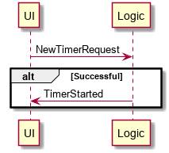
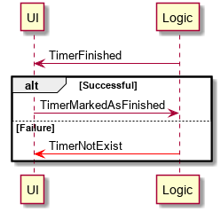
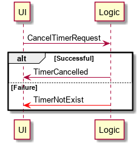
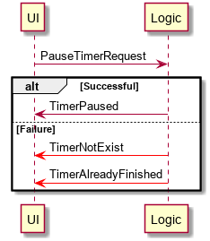
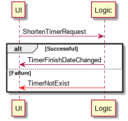
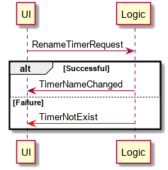

# Multitimer by Grizz

Setting simple timers with tray notification. Usefull for everyday tasks which are time based (cooking, laundry.. name it) or for browser idle games.

# Architecture

Application is fully event driven.

## Creating new timer

## When timer finishes

## Stopping timer

## Pausing timer

## Extending timer

## Shortening timer

## Renaming timer
